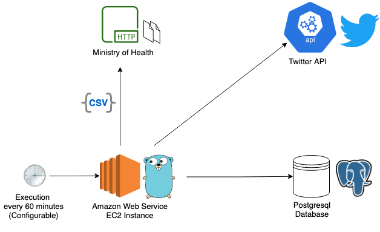

# CovidAlerts-PE project: tweets about COVID-19 for Perú

## What is CovidAlerts-PE?
**CovidAlerts-PE** is a personal project by [@angelmottap](https://twitter.com/angelmottap) with the purpose of sharing useful and straightforward information about COVID-19 in Perú via Twitter account [@DatosCovidPeru](https://twitter.com/DatosCovidPeru).  
For this goal, I process official data about COVID-19 from Ministry of Health in Perú (MINSA) which is daily updated through a public platform called Datos Abiertos.

## Why CovidAlerts-PE?
My original goal with this project was start learning the Go programming language. I wanted to start with something simple to build to learn along the process.
At the beginning I didn't know what to build but one of my best friends [@jvegar](https://github.com/jvegar) gave me an idea to consume public data. In that process of thinking I found that would be useful process data about COVID-19 from my country (Perú).  
Despite having passed 1 year, my country is still far from ending this pandemic. One thing we can do is keep us informed about the COVID-19 situation and take awareness about the risks we assume when we go out (especially if we go out with no need). In that sense I find important share simple and useful information to know what is the current COVID-19 situation.  
I see some website and twitter accounts sharing too much information about COVID-19 that I find confusing (not only for me), **CovidAlerts-PE** project help with this issue sharing daily two simple indicators:  
- Number of people confirmed with COVID-19  
- Number of people deceased

## Project status
This is project is under development, and the following is the first proposal which is up and running and sharing information through twitter account [@DatosCovidPeru](https://twitter.com/DatosCovidPeru)

## Proposal
### Architecture
This first version implement the following architecture.  

